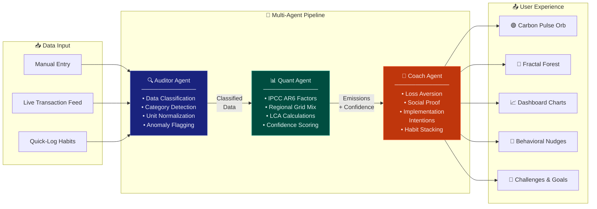
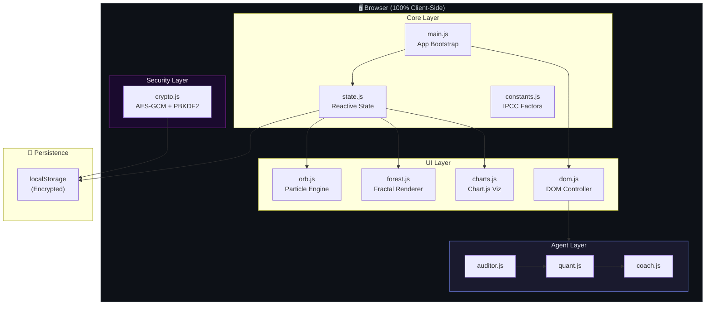

<p align="center">
  
  
  
  
</p>

<h1 align="center">🌍 EcoPulse</h1>
<h3 align="center">Carbon Footprint Awareness Platform</h3>

<p align="center">
  <strong>A multi-agent AI pipeline that helps individuals understand, track, and reduce their carbon footprint — powered by behavioral science, IPCC-grade emission factors, and beautiful real-time visualizations.</strong>
</p>

<p align="center">
  <em>Zero server dependencies · Zero data leaves your device · 100% client-side</em>
</p>

---

## 📋 Table of Contents

- [Overview](#-overview)
- [Key Differentiators](#-key-differentiators)
- [Architecture](#-architecture)
- [How It Works](#-how-it-works)
- [Features](#-features)
- [Tech Stack](#-tech-stack)
- [Getting Started](#-getting-started)
- [Project Structure](#-project-structure)
- [Privacy & Security](#-privacy--security)
- [Screenshots](#-screenshots)
- [License](#-license)

---

## 🌱 Overview

**EcoPulse** is a competition entry for **[Challenge 3] Carbon Footprint Awareness Platform** — a fully client-side, privacy-first application that transforms abstract carbon data into actionable behavioral change.

Unlike traditional carbon calculators that give you a single number and leave you wondering "now what?", EcoPulse employs a **three-agent AI pipeline** inspired by enterprise data processing systems:

1. 🔍 **Auditor Agent** — classifies and normalizes raw activity data
2. 📊 **Quant Agent** — calculates emissions using IPCC AR6 emission factors with regional adjustments
3. 🧠 **Coach Agent** — generates personalized behavioral nudges grounded in behavioral economics

The result is a living, breathing carbon dashboard where a **pulsating particle orb** changes color with your carbon status, a **procedural fractal forest** grows as you save CO₂, and every interaction is designed around the science of habit formation.

> [!NOTE]
> **No API keys, no backend, no accounts required.** Open the app and start tracking immediately. Your data never leaves your browser.

---

## 🏆 Key Differentiators

| Feature | Traditional Calculators | EcoPulse |
|---|---|---|
| **Data Processing** | Static forms | Multi-agent AI pipeline with visual feedback |
| **Emission Factors** | Generic averages | IPCC AR6 factors + regional grid intensity |
| **Behavior Change** | Tips list | BeSci nudges (Loss Aversion, Social Proof, Implementation Intentions) |
| **Visualization** | Bar charts | Particle orb + fractal forest + interactive charts |
| **Gamification** | None | Levels, streaks, challenges, achievements, carbon budget |
| **Privacy** | Cloud-dependent | Zero-knowledge AES-GCM encryption, 100% client-side |
| **Data Sync** | Account-based | Encrypted export/import — passphrase never transmitted |
| **Architecture** | Monolithic | Modular ES6 agents with observable state management |

---

## 🏗 Architecture

### Multi-Agent Pipeline

EcoPulse's core innovation is a **three-stage agent pipeline** that processes carbon data similarly to how financial systems process transactions — each agent has a single responsibility, and data flows through the pipeline in sequence.



### System Architecture



---

## ⚡ How It Works

### App Flow

```
┌─────────────────────────────────────────────────────────────┐
│  1. USER LOGS ACTIVITY                                      │
│     • Manual entry (transport, energy, food, shopping)      │
│     • Quick-log from habit presets                          │
│     • Live transaction feed (simulated banking/IoT data)    │
├─────────────────────────────────────────────────────────────┤
│  2. AUDITOR AGENT PROCESSES                                 │
│     • Classifies activity into IPCC category                │
│     • Normalizes units (km → CO₂e, kWh → CO₂e)            │
│     • Flags anomalies for review                           │
├─────────────────────────────────────────────────────────────┤
│  3. QUANT AGENT CALCULATES                                  │
│     • Applies IPCC AR6 emission factors                     │
│     • Adjusts for regional electricity grid mix             │
│     • Computes lifecycle assessment (LCA) emissions         │
│     • Assigns confidence score to each calculation          │
├─────────────────────────────────────────────────────────────┤
│  4. COACH AGENT RESPONDS                                    │
│     • Generates context-aware behavioral nudge              │
│     • Selects from BeSci toolkit:                           │
│       - Loss Aversion: "You'll waste 2.3kg if..."          │
│       - Social Proof: "78% of users switched to..."        │
│       - Implementation Intentions: "When X, I will Y"      │
│     • Updates challenge progress & streak                   │
├─────────────────────────────────────────────────────────────┤
│  5. UI REFLECTS CHANGES                                     │
│     • Carbon Pulse Orb shifts color (🟢🔵🟡🔴)              │
│     • Fractal forest grows/shrinks                          │
│     • Dashboard charts animate                              │
│     • Budget bar updates with remaining allowance            │
│     • Achievement notifications fire                        │
└─────────────────────────────────────────────────────────────┘
```

### Carbon Status Thresholds

| Status | Orb Color | Budget Usage | Meaning |
|---|---|---|---|
| 🟢 **Excellent** | Green | < 50% | Well under weekly budget |
| 🔵 **Good** | Blue | 50–75% | On track |
| 🟡 **Warning** | Amber | 75–90% | Approaching limit |
| 🔴 **Critical** | Red | > 90% | Over budget |

---

## ✨ Features

### 🤖 Multi-Agent AI Pipeline
Three specialized agents process every carbon data point in sequence. The Auditor classifies, the Quant calculates, and the Coach responds — all visible in a real-time pipeline animation with processing indicators for each stage.

### 📊 IPCC AR6-Grade Carbon Calculations
Emission factors sourced from the IPCC Sixth Assessment Report. Covers transport (car, bus, train, flight), household energy (electricity with regional grid mix, natural gas, heating oil), food (meat, dairy, vegetables, processed), and consumer goods. Each calculation includes a confidence score.

### 🧠 Behavioral Science Nudges
Every nudge is grounded in peer-reviewed behavioral economics:
- **Loss Aversion** — framing reductions as losses prevented
- **Social Proof** — showing what similar users have achieved
- **Implementation Intentions** — "When [trigger], I will [action]" templates
- **Habit Stacking** — attaching new green habits to existing routines
- **Goal Gradient** — accelerating motivation as goals approach

### 🟢 Carbon Pulse Orb
A Canvas-based particle animation at the heart of the dashboard. Dozens of particles orbit, pulse, and shift color in real-time based on your carbon status. The orb creates an ambient, always-visible feedback loop — green when you're doing well, red when you've exceeded your budget.

### 🌲 Procedural Fractal Forest
A Canvas-rendered forest that grows procedurally as you save CO₂. Each **10 kg of CO₂ saved** sprouts a new fractal tree with randomized branching angles, colors, and heights. The forest becomes a living visualization of your cumulative environmental impact.

### 🎯 Gamified Carbon Budget System
- **Weekly carbon allowance** with daily breakdown
- **10-level progression system** (Seedling → Carbon Guardian)
- **Streak tracking** with multiplier bonuses
- **Weekly challenges** (Meatless Monday, Public Transport Week, etc.)
- **Achievement badges** for milestones (First Log, Week Streak, Forest Grown, etc.)
- **XP and leveling** tied to consistent low-carbon behavior

### 🔐 Zero-Knowledge Encrypted Sync
Export your data with **AES-256-GCM** encryption derived from a passphrase via **PBKDF2** (100,000 iterations). The passphrase never leaves your device — not even in the exported file. Import on any other browser with just the passphrase. True zero-knowledge architecture.

### 📡 Live Transaction Feed
A simulated real-time feed of banking transactions and IoT sensor data (smart meter readings, transport card taps) that flows through the multi-agent pipeline. Demonstrates how EcoPulse could integrate with real financial and smart-home APIs.

### 🌿 Offset Marketplace
Browse verified carbon removal and avoidance projects:
- **Gold Standard** certified projects
- **VCS (Verra)** verified programs
- **Plan Vivo** community forestry
- Each project shows cost per tonne, verification status, and impact description

### 📱 Complete Responsive Design
- **Desktop**: Full multi-panel dashboard with side-by-side visualizations
- **Tablet**: Adaptive grid layout with collapsible sections
- **Mobile**: Bottom navigation bar, swipeable cards, touch-optimized inputs
- **Glassmorphism** design language with backdrop blur, subtle shadows, and layered transparency

### 🎨 Dark / Light / Auto Theme
Full theme system powered by CSS custom properties. Auto mode follows system preference via `prefers-color-scheme`. Smooth transitions between themes with no flash of unstyled content.

---

## 🛠 Tech Stack

| Layer | Technology | Purpose |
|---|---|---|
| **Structure** | HTML5 (Semantic) | Single-page application shell |
| **Styling** | CSS3 (Custom Properties) | 2,400+ line design system with glassmorphism |
| **Logic** | JavaScript (ES6 Modules) | Multi-agent pipeline, state management |
| **Charts** | Chart.js | Interactive emission breakdowns & trends |
| **Icons** | Lucide Icons | Consistent, lightweight icon system |
| **Animation** | Canvas API | Particle orb + fractal forest rendering |
| **Encryption** | Web Crypto API | AES-GCM + PBKDF2 zero-knowledge sync |
| **Persistence** | localStorage | Client-side data with optional encryption |
| **Build** | Vite | Development server & module bundling |

> [!IMPORTANT]
> **Zero external runtime dependencies.** Chart.js and Lucide are loaded via CDN. The entire application runs in the browser with no backend, no database, and no API keys.

---

## 🚀 Getting Started

### Prerequisites

- **Node.js** 18+ and **npm** (for the dev server only)
- A modern browser (Chrome, Firefox, Edge, Safari)

### Installation

```bash
# 1. Clone the repository
git clone https://github.com/deveshpunjabi/ecopulse.git
cd ecopulse

# 2. Install dev dependencies
npm install

# 3. Start the development server
npm run dev
```

The app will be available at `http://localhost:5173` (or the port Vite assigns).

### Quick Start Guide

1. **🟢 Open the app** — The Carbon Pulse Orb greets you, pulsing green
2. **➕ Log your first activity** — Click "Add Entry" and log a commute, meal, or energy use
3. **👀 Watch the pipeline** — See the Auditor → Quant → Coach process your data in real-time
4. **📊 Explore the dashboard** — Check your weekly budget, category breakdown, and trend charts
5. **🌲 Grow your forest** — Keep your emissions low and watch fractal trees sprout
6. **🎯 Take a challenge** — Accept a weekly challenge for bonus XP
7. **🔐 Export your data** — Use encrypted sync to back up or transfer your data

### Production Build

```bash
npm run build
```

The built files in `dist/` can be served from any static hosting (GitHub Pages, Netlify, Vercel, etc.) — no server-side runtime needed.

---

## 📁 Project Structure

```
ecopulse/
├── index.html                  # SPA entry — loads ES modules
├── package.json                # Vite dev dependency
├── README.md                   # You are here
│
└── src/
    ├── css/
    │   └── style.css           # 🎨 Complete design system (2,400+ lines)
    │                           #    ├── CSS custom properties (theming)
    │                           #    ├── Glassmorphism components
    │                           #    ├── Responsive breakpoints
    │                           #    ├── Animation keyframes
    │                           #    └── Dark/Light/Auto theme tokens
    │
    └── js/
        ├── main.js             # 🚀 App entry — bootstraps modules & event listeners
        ├── state.js            # 📦 Reactive state manager with localStorage persistence
        ├── constants.js        # 📋 IPCC emission factors, habits, challenges, offsets
        ├── crypto.js           # 🔐 AES-GCM encryption & PBKDF2 key derivation
        │
        ├── agents/
        │   ├── auditor.js      # 🔍 Agent 1: Data classification & normalization
        │   ├── quant.js        # 📊 Agent 2: LCA emission calculation engine
        │   └── coach.js        # 🧠 Agent 3: Behavioral nudge generation (BeSci)
        │
        └── ui/
            ├── dom.js          # 🖱️ DOM controller — event coordination & rendering
            ├── orb.js          # 🟢 Canvas particle system (Carbon Pulse Orb)
            ├── forest.js       # 🌲 Procedural fractal forest renderer
            └── charts.js       # 📈 Chart.js visualization configuration
```

---

## 🔒 Privacy & Security

EcoPulse is designed with a **privacy-first, zero-trust** architecture:

| Principle | Implementation |
|---|---|
| **No Server** | 100% client-side — no data ever transmitted to any server |
| **No Accounts** | No sign-up, no email, no personal identifiers collected |
| **No Tracking** | Zero analytics, zero telemetry, zero third-party scripts |
| **Encrypted Export** | AES-256-GCM with PBKDF2-derived keys (100K iterations, SHA-256) |
| **Zero-Knowledge** | Passphrase never stored, never transmitted, never logged |
| **Local Storage** | All data persists in browser localStorage under user control |
| **Open Source** | Every line of code is auditable — no obfuscation |

> [!TIP]
> **Clearing your data is instant.** Use the in-app reset function or simply clear your browser's localStorage. No "please contact support to delete your account" — your data, your control.

### Encryption Details

```
Passphrase
    │
    ▼
 PBKDF2 (100,000 iterations, SHA-256)
    │
    ▼
 256-bit AES Key
    │
    ▼
 AES-GCM Encryption (random 96-bit IV per export)
    │
    ▼
 Encrypted JSON blob (safe to store/transmit anywhere)
```

---

## 📸 Screenshots

> Screenshots showcase the app's premium glassmorphism UI across devices and themes.

| View | Description |
|---|---|
| 🖥️ **Dashboard (Dark)** | Full desktop view with Carbon Pulse Orb, budget tracker, and category breakdown |
| 📊 **Analytics Panel** | Weekly trend charts, category pie chart, and emission history |
| 🌲 **Fractal Forest** | Procedural forest with trees grown from CO₂ savings |
| 🤖 **Agent Pipeline** | Real-time visualization of Auditor → Quant → Coach processing |
| 📱 **Mobile View** | Responsive layout with bottom navigation and swipeable cards |
| 🌿 **Offset Marketplace** | Browse verified Gold Standard and VCS carbon removal projects |
| 🎨 **Light Theme** | Full light mode with preserved glassmorphism effects |

---

## 🧪 Design Decisions

### Why Multi-Agent Instead of Monolithic?

Traditional carbon calculators use a single function: `input × factor = output`. EcoPulse separates this into three agents because:

1. **Separation of Concerns** — Each agent can be tested, updated, and improved independently
2. **Visual Transparency** — Users see *how* their data is processed, building trust
3. **Extensibility** — New agents (e.g., a Forecaster or Social agent) can be added to the pipeline without modifying existing ones
4. **Educational Value** — The pipeline teaches users about emission factor science and behavioral nudging

### Why Behavioral Science?

Information alone doesn't change behavior. Research shows that:
- **Loss framing** is 2× more motivating than gain framing (Kahneman & Tversky, 1979)
- **Implementation intentions** increase follow-through by 2–3× (Gollwitzer, 1999)
- **Social proof** is the strongest motivator for environmental behavior (Cialdini, 2007)

EcoPulse applies these findings systematically through the Coach Agent.

### Why Client-Side Only?

- **Privacy by architecture** — impossible to leak what you never collect
- **Zero deployment friction** — works on any static host, no server costs
- **Offline capable** — works without internet after first load
- **Competition-friendly** — judges can run it locally in seconds

---

## 📄 License

This project is built for the **[Challenge 3] Carbon Footprint Awareness Platform** competition.

MIT License — see [LICENSE](LICENSE) for details.

---

<p align="center">
  <strong>Built with 💚 for a sustainable future</strong>
  <br/>
  <sub>EcoPulse — Because every kilogram of CO₂ matters.</sub>
</p>
